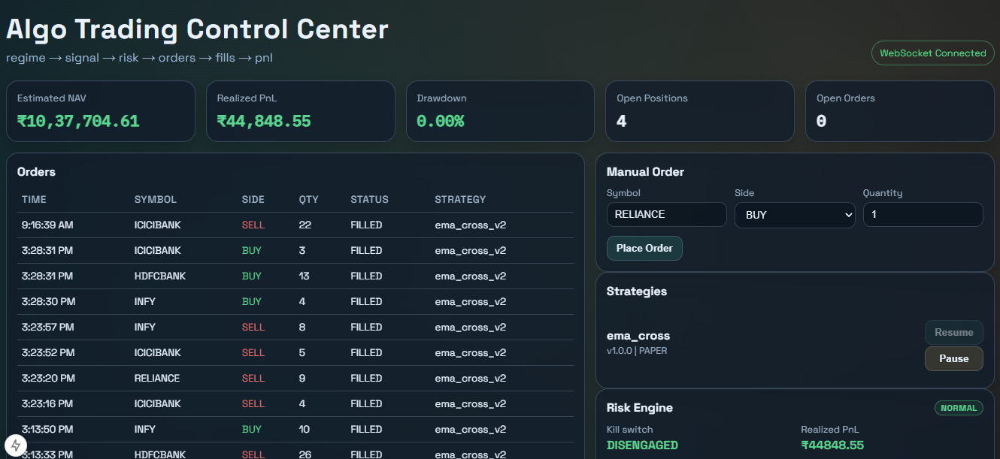
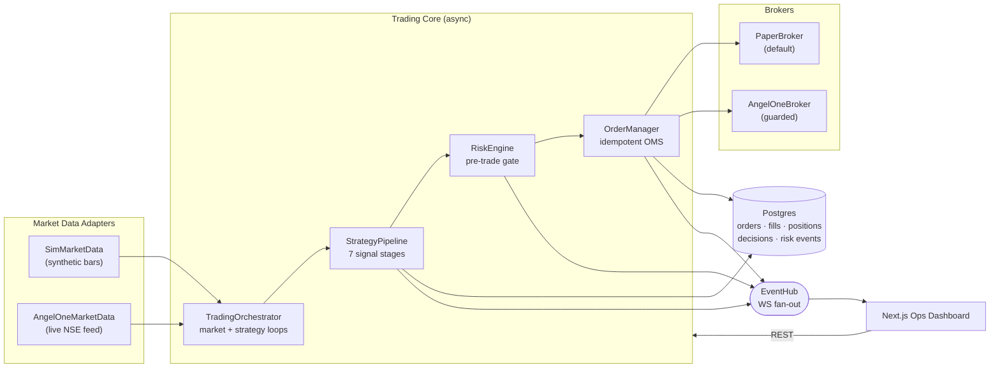

<div align="center">

# Algo Trading Platform

**A production-shaped algorithmic trading control plane for Indian equities (NSE).**

Regime detection → signal generation → risk gating → order management → fills → PnL,
wired end-to-end with a live operations dashboard.

[](https://www.python.org/)
[](https://fastapi.tiangolo.com/)
[](https://nextjs.org/)
[](https://www.postgresql.org/)
[](https://lightgbm.readthedocs.io/)
[](https://docs.docker.com/compose/)

</div>



---

## Why this project

Most trading repos are a notebook with a backtest. This one is the **operational half** that
real desks actually run on: a stateful async control plane where every order passes through a
central risk engine, every decision is written to an auditable log, and every state change is
streamed to an operator UI over WebSocket.

The quant models are not a black box either — GARCH, EGARCH, HAR-RV, a Gaussian HMM,
a Kalman filter, and Monte Carlo VaR/CVaR are implemented **from scratch in pure Python**,
so the estimation logic is readable and testable rather than hidden behind a library call.

| | |
|---|---|
| **Architecture** | Ports & Adapters (hexagonal), repository pattern, DI container |
| **Concurrency** | Fully async FastAPI; all CPU-bound quant work offloaded via `asyncio.to_thread` so the event loop never stalls |
| **Signal chain** | 7-stage composable pipeline — add a signal by adding a file, not by editing the runner |
| **Safety** | Pre-trade risk checks, drawdown scaling, daily-loss limits, kill switch, paper broker by default |
| **Realism** | Actual NSE transaction-cost model (STT, exchange fees, GST, SEBI, stamp duty) shared by the paper broker *and* the backtester |

---

## Architecture



Services depend on **`Protocol` interfaces** in [`app/ports/`](apps/api/app/ports/), never on each
other's concrete classes. Routes never open a DB session — they go through repositories resolved
from the [`ServiceContainer`](apps/api/app/core/container.py). Swapping the simulator for the live
Angel One feed, or the paper broker for a real one, is a single wiring change in
[main.py](apps/api/app/main.py).

---

## The signal pipeline

One EMA crossover becomes a sized order by passing through seven independent stages. Each stage
is a pure function of `(CycleContext, SignalContext)` — no I/O, no DB — so it can be unit-tested
by constructing two dataclasses.

| # | Stage | Model | Effect on size |
|---|---|---|---|
| 0 | Crossover | Fast/slow EMA | Emits raw ±1 signal |
| 1 | [Regime filter](apps/api/app/quant/regime.py) | 2-state Gaussian HMM (Baum-Welch EM) | ×0.5 in the choppy/high-vol regime |
| 2 | [Volatility target](apps/api/app/quant/har_rv.py) | HAR-RV (Corsi 2009), EGARCH/GARCH(1,1) fallback | `target_vol / forecast_vol` |
| 3 | [Allocation](apps/api/app/quant/portfolio_models.py) | Mean-variance ⊕ risk-parity ⊕ cross-sectional momentum | Blended weight, clamped `[0.5, 1.5]` |
| 4 | [Tail-risk guard](apps/api/app/quant/monte_carlo.py) | Monte Carlo VaR / CVaR | Scales down when VaR breaches budget |
| 5 | [Position sizing](apps/api/app/services/strategy/stages/kelly.py) | Fractional Kelly (25 %) | Bounds leverage, cuts ruin probability |
| 6 | [Pairs context](apps/api/app/quant/pairs_kalman.py) | Kalman filter — dynamic hedge ratio | −25 % when the spread contradicts the signal |
| 7 | [ML confirmation](apps/api/app/ml/model.py) | LightGBM classifier, walk-forward CV | **Veto** when the model opposes the signal |

The final quantity is `base_qty × (vol × alloc × tail × kelly × regime)`, and the full scale
breakdown is persisted to the decision log for every signal — so any trade can be reconstructed
after the fact.

### Quant library

Pure-Python, stdlib-only numerics in [`app/quant/`](apps/api/app/quant/) — importable anywhere,
no numpy required at the estimation layer:

- **Volatility** — ARCH(1), GARCH(1,1), EGARCH(1,1), HAR-RV, realized-vol annualization
- **Risk** — Monte Carlo VaR/CVaR, drawdown scaling, fractional Kelly
- **Derivatives** — Black-Scholes pricing, full Greeks, implied volatility by root-finding
- **Portfolio** — mean-variance and risk-parity weights, 12-1 cross-sectional momentum (Jegadeesh & Titman 1993)
- **Stat-arb** — OLS and Kalman-filtered pairs spreads with z-scores
- **Costs** — NSE brokerage/STT/GST/SEBI/stamp-duty schedule, one source of truth

See the [Quant Models Instruction Guide](./docs/QUANT_MODELS_INSTRUCTION_GUIDE.md) for the maths.

---

## Quick start

### Docker (recommended)

```bash
cp .env.example .env
docker compose up --build
```

| Service | URL |
|---|---|
| Ops dashboard | http://localhost:3000 |
| API docs (OpenAPI) | http://localhost:8000/docs |
| WebSocket stream | ws://localhost:8000/ws/stream |

The platform boots in **paper mode with a synthetic NSE feed** — no credentials, no API keys,
no risk. Strategies deploy themselves on startup and the dashboard fills with live orders,
fills, and PnL within seconds.

### Local (without Docker)

```bash
# Backend
cd apps/api
python -m venv .venv && . .venv/Scripts/activate    # Linux/macOS: . .venv/bin/activate
pip install -r requirements.txt
alembic upgrade head
uvicorn app.main:app --reload --port 8000

# Frontend (second terminal)
cd apps/web
npm install && npm run dev
```

---

## API surface

<details>
<summary><b>Full endpoint list</b></summary>

**Health & auth**
```
GET    /health
POST   /auth/login
POST   /auth/logout
```

**Strategies**
```
GET    /strategies
POST   /strategies/{name}/deploy
POST   /strategies/{name}/pause
POST   /strategies/{name}/resume
```

**Trading & OMS**
```
POST   /orders                     # idempotent order submission
GET    /orders
GET    /fills
GET    /positions
GET    /decisions                  # auditable signal log
GET    /risk/status
POST   /ops/kill-switch
GET    /dashboard/summary
```

**Quant analytics**
```
POST   /quant/options/black-scholes
POST   /quant/options/implied-vol
POST   /quant/portfolio/weights
```

**Backtesting**
```
POST   /backtest/run               # equity curve, Sharpe, Sortino, max DD, profit factor
POST   /backtest/costs             # NSE cost breakdown for a hypothetical trade
```

**Machine learning**
```
POST   /ml/train                   # walk-forward CV training on NSE bhavcopy history
GET    /ml/status
POST   /ml/predict/{symbol}
DELETE /ml/model
```

**Streaming**
```
WS     /ws/stream                  # bars, signals, ML vetoes, order updates, risk events
```

</details>

---

## Risk controls

Every order — manual or strategy-generated — passes the same
[`RiskEngine`](apps/api/app/services/risk_engine.py) gate before it reaches a broker:

- Max order quantity, max position notional, max open orders
- Daily realized-loss limit with automatic halt
- Monte Carlo VaR/CVaR ceilings (`MAX_MC_VAR_INR`, `MAX_MC_CVAR_INR`)
- Drawdown-proportional position scaling
- Operator **kill switch** that blocks the entire order path in one call

Rejections are written to the `risk_events` table and broadcast to the dashboard.

---

## Configuration

Copy `.env.example` → `.env`. The keys that matter most:

| Key | Default | Purpose |
|---|---|---|
| `DEFAULT_BROKER` | `paper` | Safe default — never executes real orders |
| `SYMBOL_UNIVERSE` | `RELIANCE,TCS,INFY,HDFCBANK,ICICIBANK` | Traded universe |
| `MAX_DAILY_LOSS_INR` | `5000` | Hard daily stop |
| `MAX_POSITION_NOTIONAL_INR` | `100000` | Per-symbol exposure cap |
| `ENABLE_MONTE_CARLO_RISK` | `true` | Turns on MC VaR/CVaR pre-trade checks |
| `ANGEL_ONE_*` | *(empty)* | Optional live NSE market-data feed (paper execution still) |
| `NEXT_PUBLIC_API_BASE_URL` / `NEXT_PUBLIC_WS_URL` | localhost | Frontend wiring |

Setting all four `ANGEL_ONE_*` credentials plus `ANGEL_ONE_SYMBOL_TOKENS` switches the market-data
adapter from the simulator to the **real NSE feed** while execution stays on the paper broker —
real prices, zero capital at risk.

---

## Tests

```bash
cd apps/api
python -m pytest tests -q
```

Covers the paper broker's cost/fill accounting, settings parsing, and the quant model
estimators. `python -m compileall app` is a fast syntax gate for the whole backend.

---

## Repository layout

```
apps/
  api/                     FastAPI control plane
    app/
      api/routes/          HTTP + WS endpoints (thin — no business logic)
      core/               config, DI container, DB, event hub, market hours
      ports/              Protocol interfaces (broker, market data, repositories)
      infra/              adapters: sim + Angel One feeds, SQLAlchemy repositories
      services/           orchestrator, OMS, risk engine, backtester, brokers
        strategy/stages/  the 7 composable signal stages
      quant/              volatility, risk, options, portfolio, pairs, costs
      ml/                 LightGBM directional classifier
      data/               NSE bhavcopy EOD downloader
      models/             SQLAlchemy ORM tables
    alembic/              schema migrations
  web/                     Next.js 15 operations dashboard
packages/core/             shared contracts
infra/docker/              container definitions
docs/                      architecture, quant guide, phase-by-phase wiki
```

---

## Documentation

- [Project Documentation](./docs/PROJECT_DOCUMENTATION.md) — system design, component internals, working flows
- [Quant Models Instruction Guide](./docs/QUANT_MODELS_INSTRUCTION_GUIDE.md) — model maths and usage
- [Engineering Wiki](./docs/wiki/) — build phases: foundation → signal quality → risk architecture → execution realism → infrastructure
- [Guidebook](./Algo_Trading_Platform_Guidebook.md) — the design brief this platform implements

---

## Angel One live-broker note

[`AngelOneBroker`](apps/api/app/services/angel_one_broker.py) is wired into the architecture but
**intentionally rejects orders by default** until a production-safe auth/session-refresh flow is
in place. Paper execution is fully operational and travels the identical OMS and risk path, so
enabling live execution is a broker swap — not a rewrite.

## Disclaimer

This is an engineering platform, not financial advice. Keep credentials out of source control,
run in paper mode, and validate behaviour thoroughly before risking capital.
