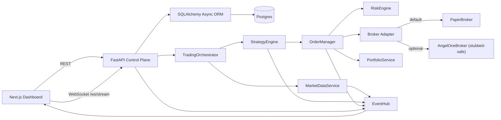
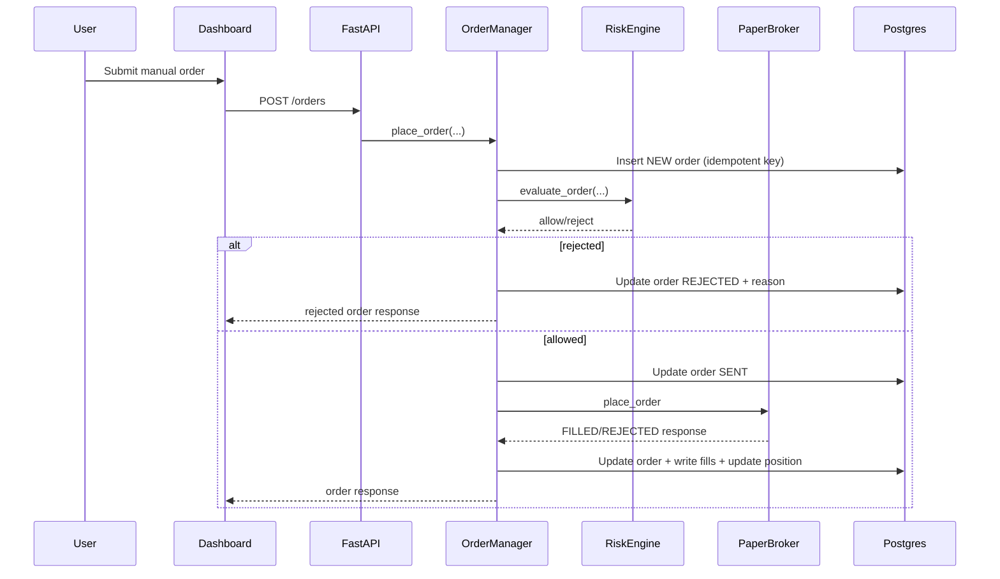

# Algo Platform - High-Level and Low-Level Documentation

## 1. Purpose and Scope

This document explains the current implementation of the `algo-platform` project from high-level architecture down to low-level component behavior, including:

- System design and module boundaries
- Runtime behavior and data flow
- Backend and frontend low-level design
- Current operating model
- Practical improvements and roadmap

This is engineering documentation for the code currently present in this repository.

For operational usage and verification of quant models, refer to:

- `docs/QUANT_MODELS_INSTRUCTION_GUIDE.md`

## 2. System Overview (HLD)

`algo-platform` is a full-stack algorithmic trading control platform template with:

- Backend control plane (`FastAPI` + async `SQLAlchemy`)
- Simulated market data and strategy runtime
- Centralized risk checks and kill switch
- OMS and broker abstraction (paper broker active by default)
- Portfolio and audit-style ledgers (orders, fills, decisions, risk events)
- Operations dashboard (`Next.js`) with REST polling + WebSocket stream
- Local/dev infrastructure via Docker Compose (`Postgres`, `Redis`, API, Web)

### 2.1 High-Level Component Diagram



### 2.2 Design Characteristics

- Single-process backend runtime where API + orchestration loops run in one FastAPI app lifespan.
- Database-first persistence for market bars, strategy configs, orders, fills, positions, decision logs, and risk events.
- Event broadcasting model via in-memory WebSocket hub (`EventHub`) for live UI updates.
- Paper/live broker pluggability through a factory and adapter abstraction.

## 3. Repository and Module Layout

```text
algo-platform/
  apps/
    api/   -> FastAPI backend, services, ORM models, tests
    web/   -> Next.js dashboard (app router)
  infra/   -> currently empty placeholder
  packages/-> currently empty placeholder
  docker-compose.yml
  .env.example
  README.md
```

## 4. Runtime and Deployment Model

### 4.1 Docker Compose Topology

- `postgres` (`postgres:16-alpine`) on `5432`
- `redis` (`redis:7-alpine`) on `6379`
- `api` (`uvicorn app.main:app --reload`) on `8000`
- `web` (`npm run dev`) on `3000`

### 4.2 Startup Lifecycle (Backend)

At API startup (`app.main.lifespan`):

1. Load settings from environment.
2. Create DB schema via `init_db()` (SQLAlchemy `create_all`).
3. Instantiate all services and wire dependencies.
4. Seed default strategy (`ema_cross`) if missing.
5. Start orchestrator:
   - market data generation loop
   - strategy loop
6. On shutdown: stop loops and cancel tasks.

## 5. End-to-End Working Flow

### 5.1 Continuous Runtime Loop

1. `MarketDataService` generates synthetic bars every 2 seconds and persists them.
2. Prices and recent closes are updated in memory.
3. `StrategyEngine` runs every 2 seconds, reading active strategy params and checking crossover regime changes.
4. On signal transition:
   - Write `DecisionLog`
   - Place order through `OrderManager`
5. `OrderManager`:
   - Creates idempotent order record
   - Runs risk checks
   - Sends to broker adapter
   - Persists fills and updates portfolio
   - Emits WebSocket events
6. Frontend receives event stream and also polls REST endpoints for synchronized state snapshots.

### 5.2 Manual Order Flow (Dashboard)



### 5.3 Kill Switch Flow

1. UI calls `POST /ops/kill-switch`.
2. `RiskEngine.set_kill_switch(...)` toggles flag and records `RiskEvent`.
3. Event is broadcast (`risk.kill_switch`).
4. All subsequent `evaluate_order(...)` calls reject while active.

## 6. Backend High-Level Design

### 6.1 API Layer

Routers:

- `/health`
- `/auth/*`
- `/strategies/*`
- trading routes (`/orders`, `/fills`, `/positions`, `/decisions`, `/risk/status`, `/ops/kill-switch`)
- `/dashboard/summary`

Dependency injection uses a single `ServiceContainer` in `app.state.container`.

### 6.2 Service Layer

- `TradingOrchestrator`: lifecycle coordinator and loop scheduling
- `MarketDataService`: synthetic market feed + bar persistence + in-memory price cache
- `StrategyEngine`: strategy logic executor and signal generation
- `RiskEngine`: pre-trade risk checks + kill switch + risk events
- `OrderManager`: order lifecycle + broker integration + fill handling
- `PortfolioService`: position and realized PnL updates
- `EventHub`: WebSocket connection manager and event broadcaster
- Quant modules (`app/quant`):
  - `ARCH(1)` and `GARCH(1,1)` volatility models
  - Monte Carlo `VaR/CVaR` simulation utilities
  - Black-Scholes pricing, Greeks, and implied volatility
  - Mean-variance, risk parity, Kelly sizing helpers
  - Pairs spread/z-score signal utility
- Broker adapters:
  - `PaperBroker` (active)
  - `AngelOneBroker` (intentionally safe-disabled for live execution)

### 6.3 Data Layer

Async SQLAlchemy ORM with Postgres using model-per-table mapping.
Schema is created on boot (`create_all`), no migration framework currently.

## 7. Backend Low-Level Design (LLD)

### 7.1 Core Configuration

`Settings` fields control:

- Environment and networking
- Broker selection and symbols
- Risk thresholds
- Optional Angel One credentials

Derived property:

- `symbols`: parsed from `SYMBOL_UNIVERSE`

### 7.2 Database Models (Current Schema)

- `Instrument`
  - Unique `(symbol, exchange)`
  - Tick/lot metadata
- `Bar`
  - FK to `Instrument`
  - OHLCV + interval + timestamp
- `StrategyConfig`
  - Name, version, active flag, mode, JSON parameters
- `Order`
  - UUID primary key
  - `idempotency_key` unique
  - side/type/status enums
  - broker response fields and timestamps
- `Fill`
  - FK to order
  - quantity, price, fee, fill timestamp
- `Position`
  - Unique symbol
  - quantity, avg price, realized pnl
- `DecisionLog`
  - strategy decision trace with confidence/reason/payload
- `RiskEvent`
  - risk/audit trail with severity + JSON context

### 7.3 Order Lifecycle State Handling

Implemented transitions in OMS:

- `NEW -> SENT`
- `SENT -> FILLED` (if fills present)
- `SENT -> ACKED` (accepted but no fills)
- `NEW/SENT -> REJECTED` (risk or broker rejection)

Not yet implemented in this template:

- `PARTIALLY_FILLED` transitions
- cancel/replace workflow
- explicit reconciliation worker against broker source of truth

### 7.4 Risk Engine Rules

`evaluate_order(...)` currently enforces:

1. kill switch must be off
2. quantity > 0
3. quantity <= `MAX_ORDER_QTY`
4. notional <= `MAX_POSITION_NOTIONAL_INR`
5. open orders < `MAX_OPEN_ORDERS`
6. realized pnl > negative `MAX_DAILY_LOSS_INR`
7. optional Monte Carlo VaR/CVaR guardrails (configurable)

If daily loss breached, engine:

- writes `RiskEvent(event_type="DAILY_LOSS_LIMIT")`
- toggles in-memory kill switch to `True`
- blocks new orders

### 7.5 Market Simulation Details

Per symbol (every cycle):

- start from previous close
- apply drift + gaussian shock
- build OHLC and random volume
- persist to `bars`
- update in-memory latest price and recent closes deque
- broadcast `market.bars` event with payload

Default cadence is 2 seconds, while interval label is `"1m-sim"` (semantic simulation interval, not wall clock 1 minute).

### 7.6 Strategy Engine Details

Current strategy: `ema_cross`

Runtime behavior:

- Reads strategy config from DB each run
- Parameters:
  - `fast_window` (default 8)
  - `slow_window` (default 21)
  - `trade_quantity` (default 5)
- Uses arithmetic means (`statistics.fmean`) over recent closes
- Maintains per-symbol regime state (`bullish=1`, `bearish=-1`)
- Acts only on state changes:
  - bullish transition: buy
  - bearish transition: sell only if position qty > 0
- Logs each transition to `DecisionLog`
- Emits `strategy.signal` stream events

### 7.7 Portfolio Accounting Logic

On BUY fill:

- weighted average price update
- increase quantity

On SELL fill:

- `sell_qty = min(fill_qty, current_qty)`
- realized pnl increment:
  - `(fill_price - avg_price) * sell_qty - fee`
- quantity decrement
- reset avg price to 0 when flat

### 7.8 Event Streaming Contract (Observed Events)

WebSocket endpoint: `/ws/stream`

Payload shape:

```json
{
  "event": "event.name",
  "data": {},
  "timestamp": "UTC ISO8601"
}
```

Examples:

- `system.ready`
- `market.bars`
- `strategy.signal`
- `order.rejected`
- `order.updated`
- `order.filled`
- `risk.kill_switch`

### 7.9 API Endpoint Catalog

### Health/Auth

- `GET /health`
- `POST /auth/login`
- `POST /auth/logout`

### Strategy Ops

- `GET /strategies`
- `POST /strategies/{strategy_name}/deploy`
- `POST /strategies/{strategy_name}/pause`
- `POST /strategies/{strategy_name}/resume`

### Trading and Risk

- `POST /orders`
- `GET /orders`
- `GET /fills`
- `GET /positions`
- `GET /decisions`
- `GET /risk/status`
- `POST /ops/kill-switch`
- `GET /dashboard/summary`
- `POST /quant/options/black-scholes`
- `POST /quant/options/implied-vol`
- `POST /quant/portfolio/weights`

## 8. Frontend High-Level Design

The frontend is a single-page operational dashboard (`app/page.tsx`, client component) with:

- periodic REST refresh (`5s`)
- WebSocket stream subscription (`/ws/stream`)
- operator actions:
  - place manual order
  - pause/resume strategies
  - engage/release kill switch

Presentation split into reusable components:

- `StatCard`
- `OrdersTable`
- `PositionsTable`
- `FeedPanel`
- `StrategyPanel`
- `RiskPanel`
- `ManualOrderForm`

## 9. Frontend Low-Level Design

### 9.1 Data Access Layer

`app/lib/api.ts`:

- central `apiRequest<T>(...)` helper
- `cache: "no-store"` for fresh reads
- typed wrappers for each backend endpoint

### 9.2 State and Refresh Mechanics

In `page.tsx`:

- `useState` stores snapshots for summary/orders/fills/positions/strategies/decisions/risk/stream
- `refresh()` calls multiple endpoints with `Promise.all`
- polling interval: 5000 ms

WebSocket behavior:

- connect on mount
- update connection status pill
- parse incoming JSON and prepend to stream
- trigger `refresh()` on critical events:
  - `order.filled`
  - `order.updated`
  - `order.rejected`
  - `risk.kill_switch`
- send `ping` every 20 seconds while connected

### 9.3 UI Behavior Notes

- Currency is formatted with `Intl.NumberFormat("en-IN", INR)` for summary cards.
- Orders/stream times are rendered with local `toLocaleTimeString()`.
- Forms are controlled inputs.
- Responsive behavior via CSS media queries.

## 10. Configuration Reference

Key environment variables:

- `DATABASE_URL`, `REDIS_URL`
- `DEFAULT_BROKER`
- `SYMBOL_UNIVERSE`
- `MAX_DAILY_LOSS_INR`
- `MAX_POSITION_NOTIONAL_INR`
- `MAX_OPEN_ORDERS`
- `MAX_ORDER_QTY`
- `NEXT_PUBLIC_API_BASE_URL`
- `NEXT_PUBLIC_WS_URL`

Current defaults are safe for local paper-mode simulation.

## 11. Testing and Quality Status

Current tests:

- `test_paper_broker.py`
- `test_settings.py`

Coverage summary:

- Basic broker simulation behavior
- Settings parsing logic

Gaps:

- no API route integration tests
- no risk engine unit suite
- no strategy engine deterministic tests
- no frontend tests
- no end-to-end orchestration tests

## 12. Known Limitations

1. Authentication is placeholder (`admin/admin`, base64 token), not production-safe.
2. No migration tooling (`create_all` only), so schema evolution is manual-risky.
3. `RiskEngine` daily-loss logic does not reset by trading day yet.
4. Single process hosts both API and background loops (limited fault isolation and scalability).
5. Redis is configured but not used for queues/pub-sub/session state.
6. Broker reconciliation and advanced OMS states are minimal.
7. Angel One adapter is intentionally blocked until robust auth/token refresh is implemented.
8. Strategy engine currently supports one hardcoded strategy (`ema_cross`) runtime path.
9. Observability is limited (no metrics/tracing dashboards).
10. Testing breadth is currently low for critical trading paths.

## 13. Improvement Roadmap (Prioritized)

### 13.1 Immediate (High Impact)

1. Add real authentication and authorization:
   - secure JWT/session flow
   - RBAC for operator controls (kill switch, strategy control, manual order)
2. Introduce DB migrations (Alembic) and schema versioning.
3. Expand tests for risk, OMS, API, and strategy transitions.
4. Add deterministic simulation mode (seeded randomness) for reproducible tests.
5. Implement true daily PnL boundary reset aligned to market day.

### 13.2 Near-Term (Reliability and Scale)

1. Split runtime loops into worker process/service (API control plane vs execution worker).
2. Add broker reconciliation loop and order repair workflows.
3. Implement cancel/amend operations and partial fill handling.
4. Use Redis for pub/sub fanout or job queueing.
5. Add structured logging, Prometheus metrics, and tracing.

### 13.3 Mid-Term (Trading Capability)

1. Strategy plugin/registry model to support multiple strategy classes.
2. Parameter governance:
   - typed schema
   - validation rules
   - versioned rollout controls
3. Improve market simulator:
   - spread model
   - partial fills
   - reject/latency scenarios
4. Add market-hours and holiday calendar guardrails for India exchanges.

### 13.4 Frontend Improvements

1. Add query caching/state library (e.g., TanStack Query) for cleaner data synchronization.
2. Surface richer operator workflows:
   - order detail drill-down
   - risk audit timeline
   - strategy parameter editor with validation
3. Improve resilience UX:
   - retry UI
   - stale-data indicator
   - disconnected mode guidance
4. Add component and end-to-end tests.

## 14. Suggested Next Engineering Milestone

Recommended next milestone:

1. Harden control plane security and migrations.
2. Add comprehensive risk/OMS test suite.
3. Separate worker runtime from API process.
4. Implement reconciliation + partial fills.

This gives the best risk-reduction per effort before enabling any live broker path.
